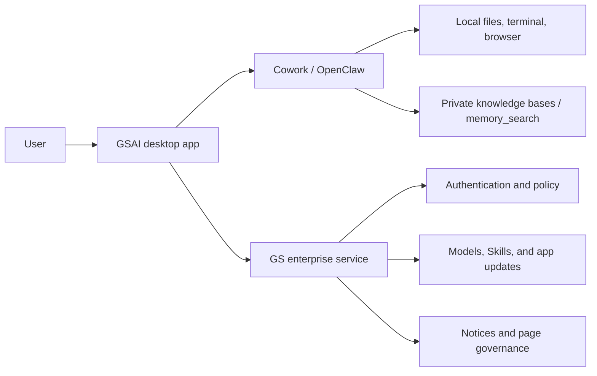

# GSAI Office Collaboration — Enterprise LobsterAI Edition

<p align="center">
  
</p>

<p align="center">
  <strong>An enterprise desktop Agent customized for Guosheng Securities office and research workflows</strong>
</p>

<p align="center">
  <em><code>gsai-office-customization</code> branch · version 0.1.6</em>
</p>

<p align="center">
  
  
  
  <a href="LICENSE"></a>
</p>

<p align="center">
  <a href="#quick-start"><strong>Quick Start</strong></a>
  &nbsp;·&nbsp;
  <a href="#enterprise-configuration"><strong>Enterprise Configuration</strong></a>
  &nbsp;·&nbsp;
  English · <a href="README_zh.md">中文</a>
</p>

---

This branch customizes the open-source **LobsterAI** desktop Agent for an intranet deployment with enterprise identity, centralized governance, private knowledge, and securities research workflows. It retains Cowork, OpenClaw, local tool execution, Artifacts, persistent memory, and scheduled tasks while adding enterprise authentication, private knowledge bases, financial Skills, cloud-managed models and Skills, application updates, and notices.

The default branding configuration disables upstream Youdao cloud services, the IM settings page, voice input, and image/video model pickers. Conversations, knowledge bases, and most working data remain local; the enterprise service supplies identity, policy, and managed resources.

## Branch Highlights

- **Config-driven white label** — Product name, icons, installer filename, default workspace, and About-page details are centrally configurable
- **Enterprise authentication** — Username/password, email verification, and WeCom login methods when enabled by the server, plus password changes and offline config fallback
- **Central governance** — The server controls settings pages, submit permission, external Skill installation, Skill state, model configuration, application updates, and notices
- **Private knowledge bases** — Create multiple local knowledge bases, import files or folders in batches, and explicitly reference them in Cowork prompts
- **Financial research Skills** — Market quotes, movement attribution, macro news, themes, screening, stock/fund diagnosis, and GSAI chat
- **Managed Skill lifecycle** — Server Skills sync by version; installed Skills report source, risk level, user identity, and `SKILL.md` content fingerprints
- **Enhanced report writing** — `rich-report` is the default writing Skill with Word/Excel input, charts, and standardized report styling
- **Intranet-first models** — An OpenAI-compatible internal provider can be pre-seeded and replaced by server-managed model configuration

## Typical Scenarios

| Scenario | Example |
|----------|---------|
| **Private-document Q&A** | Build policy or research knowledge bases from PDF, Word, Excel, CSV, Markdown, and text files, then reference them in a conversation |
| **Market and movement analysis** | Combine market quotes, movement attribution, macro news, and themes into a research summary |
| **Screening and diagnosis** | Use stock screening, stock diagnosis, fund selection, and fund diagnosis Skills |
| **Automated reporting** | Turn local documents or Excel data into standardized Word reports and presentation decks |
| **Managed enterprise configuration** | Apply server-delivered models, Skills, page permissions, submit policy, and update schedules after login |
| **Continuous office automation** | Use local files, the terminal, browser, and scheduled tasks for recurring checks and deliverables |

## How It Works



## Quick Start

### Prerequisites

- **Node.js** >= 24 < 25
- **npm** or **pnpm**
- Windows packaging requires PowerShell, PortableGit, and installed project dependencies

### 1. Clone & install

```bash
git clone https://github.com/baowanli719/LobsterAI.git
cd LobsterAI
git checkout gsai-office-customization
pnpm install
```

### 2. Start the app

> [!IMPORTANT]
> Cowork mode runs on the **OpenClaw** agent engine. The **first launch must build the OpenClaw runtime**, or Cowork sessions won't start. Use the `electron:dev:openclaw` command for the first run.

```bash
# First run: builds the OpenClaw runtime, then starts the app.
# Clones & builds OpenClaw on first run — this can take several minutes.
npm run electron:dev:openclaw
```

Once the runtime has been built, day-to-day development can use the faster command —
it reuses the existing runtime and skips the OpenClaw build step:

```bash
npm run electron:dev
```

The Vite dev server runs at `http://localhost:5175`. Before starting, verify the enterprise server and default-model configuration for the target environment. Do not commit real tokens, passwords, or production API keys.

### Enterprise Configuration

| File / entry point | Purpose |
|--------------------|---------|
| `src/shared/branding/branding.config.json` | Product name, logo, installer name, feature flags, and default GS server URL |
| `src/shared/about/about.config.json` | About-page product name, maintenance owner, contacts, and links |
| `src/shared/defaultModel/defaultModel.config.json` | OpenAI-compatible provider seeded on first launch; replace endpoint and credentials before deployment |
| `enterprise-config/manifest.json` | Machine-level page controls, server URL locking, and OpenClaw/Skills/Agents/MCP/Plugins sync policy |
| `SKILLs/skills.config.json` | Enabled state, ordering, and base display metadata for bundled Skills |
| `GS_SERVER_URL` | Development-time enterprise server URL override |

The enterprise server URL is resolved in this order: local user override, `enterprise-config/manifest.json`, the branding default, then `GS_SERVER_URL`. When the manifest sets `server.lockBaseUrl=true`, the login dialog cannot change the URL.

If the enterprise service is unavailable, the client keeps the most recently synchronized user and policy configuration and enters offline mode. Operations that require online authentication or server authorization remain restricted.

#### OpenClaw build options

The required OpenClaw version is pinned in `package.json` under `openclaw.version`, and
its source is cloned/managed at `../openclaw` (relative to this repo) by default.

```bash
# Use a custom OpenClaw source path
OPENCLAW_SRC=/path/to/openclaw npm run electron:dev:openclaw

# Force a rebuild even when the pinned version hasn't changed
OPENCLAW_FORCE_BUILD=1 npm run electron:dev:openclaw

# Skip the automatic version checkout (e.g. when developing OpenClaw locally)
OPENCLAW_SKIP_ENSURE=1 npm run electron:dev:openclaw
```

### Production Build

```bash
# TypeScript compilation + Vite bundle
npm run build

# ESLint check
npm run lint
```

## Packaging & Distribution

<details>
<summary>Build commands, channel packages, manual runtime build & Windows Python bundling</summary>

Uses [electron-builder](https://www.electron.build/) to produce platform-specific installers. Output goes to `release/`.

```bash
# macOS (.dmg)
npm run dist:mac

# macOS - Intel only
npm run dist:mac:x64

# macOS - Apple Silicon only
npm run dist:mac:arm64

# macOS - Universal (both architectures)
npm run dist:mac:universal

# Windows (.exe NSIS installer)
npm run dist:win

# Linux (.AppImage & .deb)
npm run dist:linux
```

Build channel-specific packages by setting `KEYFROM`:

```bash
# macOS - Intel only
KEYFROM=xxx npm run dist:mac:x64

# macOS - Apple Silicon only
KEYFROM=xxx npm run dist:mac:arm64

# Windows (.exe NSIS installer)
npx cross-env KEYFROM=xxx npm run dist:win
```

Desktop packaging (macOS / Windows / Linux) bundles a prebuilt OpenClaw runtime under `Resources/cfmind`.
The pinned OpenClaw version (`package.json` → `openclaw.version`) is automatically fetched and built during packaging — no manual setup needed.
The build is cached: if the runtime for the pinned version already exists locally, the build step is skipped automatically.

You can also build OpenClaw runtime manually:

```bash
# Build runtime for current host platform (auto-detect mac/win/linux + arch)
npm run openclaw:runtime:host

# Build explicit targets
npm run openclaw:runtime:mac-arm64
npm run openclaw:runtime:mac-x64
npm run openclaw:runtime:win-x64
npm run openclaw:runtime:linux-x64
```

Override OpenClaw source path with an environment variable when needed:

```bash
OPENCLAW_SRC=/path/to/openclaw npm run dist:win
```

Windows builds bundle a portable Python runtime under `resources/python-win` (included as installer resource `python-win`), so end users do not need to install Python manually.
The bundled runtime is interpreter-focused and does not preinstall LobsterAI skill Python packages; those can be installed at runtime on demand.
By default, packaging downloads the official Python embeddable runtime from python.org if no prebuilt archive is provided.
For offline/non-network builds, provide a prebuilt runtime archive explicitly.

Offline/runtime source options for packaging:
- `LOBSTERAI_PORTABLE_PYTHON_ARCHIVE`: Local prebuilt runtime archive path (recommended for offline CI/CD)
- `LOBSTERAI_PORTABLE_PYTHON_URL`: Download URL for the prebuilt runtime archive
- `LOBSTERAI_WINDOWS_EMBED_PYTHON_VERSION` / `LOBSTERAI_WINDOWS_EMBED_PYTHON_URL` / `LOBSTERAI_WINDOWS_GET_PIP_URL`: Optional overrides for Windows-host bootstrap sources

</details>

### Fast Windows Packaging

When dependencies are unchanged and the OpenClaw runtime is ready, use the fast script to avoid an implicit package-manager reinstall or native rebuild during packaging:

```powershell
# Standard fast package
.\scripts\dist-win-fast.ps1

# Rebuild the OpenClaw runtime first
.\scripts\dist-win-fast.ps1 -PrepareOpenClawRuntime

# Incremental package: reuse renderer output and skip Skill builds
.\scripts\dist-win-fast.ps1 -SkipRendererBuild -SkipSkills
```

The script raises the Node heap limit to 4 GB by default and calls the local toolchain directly. Run `pnpm install` manually whenever dependencies change.

## Architecture

LobsterAI uses Electron's strict process isolation. All cross-process communication goes through IPC.

### Process Model

**Main Process** (`src/main/main.ts`):
- Window lifecycle management
- SQLite persistence
- OpenClaw agent engine (primary) + CoworkEngineRouter dispatch layer
- GS enterprise authentication, client-policy refresh, notices, model/Skill synchronization, and application updates
- Private knowledge-base file management, format conversion, and OpenClaw `memory_search` indexing
- IM gateway code remains available, but the current branding disables startup and hides its settings by default
- 40+ IPC channel handlers
- Security: context isolation enabled, node integration disabled, sandbox enabled

**Preload Script** (`src/main/preload.ts`):
- Exposes `window.electron` API via `contextBridge`
- Includes `cowork` namespace for session management and stream events

**Renderer Process** (`src/renderer/`):
- React 18 + Redux Toolkit + Tailwind CSS
- Enterprise login, notice banner, knowledge bases, Skill management, Cowork, and settings UI
- Communicates with main process exclusively through IPC

### Directory Structure

<details>
<summary>View the full source tree</summary>

```
src/
├── main/                           # Electron main process
│   ├── main.ts                     # Entry point, IPC handlers
│   ├── preload.ts                  # Security bridge
│   ├── sqliteStore.ts              # SQLite storage
│   ├── coworkStore.ts              # Session/message CRUD
│   ├── skillManager.ts             # Skill management
│   ├── im/                         # IM gateways (WeChat/WeCom/DingTalk/Feishu/QQ/Telegram/Discord/POPO)
│   └── libs/
│       ├── agentEngine/
│       │   ├── coworkEngineRouter.ts    # Dispatch layer (routes sessions to the active engine)
│       │   ├── openclawRuntimeAdapter.ts # Primary OpenClaw gateway adapter
│       │   └── claudeRuntimeAdapter.ts  # Legacy built-in adapter (deprecated)
│       ├── coworkRunner.ts          # Legacy built-in executor (deprecated)
│       ├── openclawEngineManager.ts # OpenClaw runtime lifecycle (install/start/status)
│       ├── openclawConfigSync.ts    # Syncs Cowork, models, and KB index config
│       ├── gsServerAuth.ts          # Enterprise login, policies, and notices
│       ├── gsModelSync.ts           # Applies server-managed model config
│       ├── gsSkillSync.ts           # Syncs server Skills and reports inventory
│       ├── knowledgeBaseManager.ts  # Private knowledge-base file management
│       └── knowledgeBaseImportConverters.ts # Office/PDF text conversion
│
├── renderer/                        # React frontend
│   ├── App.tsx                     # Root component
│   ├── types/                      # TypeScript definitions
│   ├── store/slices/               # Redux state slices
│   ├── services/                   # Business logic (API/IPC/i18n)
│   └── components/
│       ├── cowork/                 # Cowork UI components
│       ├── artifacts/              # Artifact renderers
│       ├── skills/                 # Policy-aware Skill management UI
│       ├── kits/                   # Expert Kits and knowledge-base UI
│       ├── im/                     # IM integration UI
│       ├── GsLoginDialog.tsx       # Enterprise login
│       ├── GsNoticeBanner.tsx      # Server-delivered notices
│       └── Settings.tsx            # Settings and page governance
│
SKILLs/                              # Skill definitions
├── skills.config.json              # Skill enable/disable and ordering
├── web-search/                     # Web search
├── docx/                           # Word document generation
├── xlsx/                           # Excel spreadsheets
├── pptx/                           # PowerPoint presentations
├── pdf/                            # PDF processing
├── rich-report/                    # Enterprise report generation
├── market_quotes/                  # Market quotes
├── stock_diagnosis/                # Stock diagnosis
├── fund_diagnosis/                 # Fund diagnosis
├── playwright/                     # Web automation
└── ...                             # More skills
```

</details>

## Cowork System

Cowork is the core feature of LobsterAI — an AI working session system powered by OpenClaw as the primary agent engine. Designed for productivity scenarios, it can autonomously complete complex tasks like data analysis, document generation, and information retrieval.

<details>
<summary>Execution modes, stream events & permission control</summary>

### Execution Modes

| Mode | Description |
|------|-------------|
| `auto` | Automatically selects based on context |
| `local` | Direct local execution, full speed |

### Stream Events

Cowork uses IPC events for real-time bidirectional communication:

- `message` — New message added to the session
- `messageUpdate` — Incremental streaming content update
- `permissionRequest` — Tool execution requires user approval
- `complete` — Session execution finished
- `error` — Execution error occurred

### Permission Control

All tool invocations involving file system access, terminal commands, or network requests require explicit user approval in the `CoworkPermissionModal`. Both single-use and session-level approvals are supported.

</details>

## Skills System

This branch focuses on office and securities-research Skills. `SKILLs/skills.config.json` controls bundled Skill state and ordering, while server-uploaded Skills synchronize by version after login or policy refresh.

<details>
<summary>View key Skills</summary>

| Skill | Function | Typical Use Case |
|-------|----------|-----------------|
| rich-report | Enterprise report generation | Word/Excel input, charts, standardized styling |
| web-search | Web search | Information retrieval, research |
| docx | Word document generation | Reports, proposals |
| xlsx | Excel spreadsheet generation | Data analysis, dashboards |
| pptx | PowerPoint creation | Presentations, business reviews |
| pdf | PDF processing | Document parsing, format conversion |
| playwright | Web automation | Browser tasks, automated testing |
| market_quotes | Market quotes | Index, stock, and fund quotes |
| movement_attribution | Movement attribution | Explain market or security movements |
| macro_news | Macro news | Policy and macro-market briefings |
| theme_concept | Themes and concepts | Research market themes and concepts |
| smart_stock_screener | Smart stock screening | Filter stocks from user criteria |
| stock_diagnosis | Stock diagnosis | Fundamentals and trading-performance analysis |
| smart_fund_picker | Smart fund selection | Select funds for a stated objective |
| fund_diagnosis | Fund diagnosis | Fund performance and risk analysis |
| gst_ai_chat | GSAI chat | Connect to Guosheng business Q&A |
| stock-analyzer | Stock deep analysis | A-share research, valuation and financials |
| stock-announcements | Stock announcement retrieval | Listed company filings, disclosure lookup |
| stock-explorer | Stock information explorer | Basic stock info, market overview |
| local-tools | Local system tools | File management, system operations |
| imap-smtp-email | Email send/receive | Email processing, auto-replies |
| create-plan | Plan authoring | Project planning, task breakdown |
| skill-vetter | Skill security audit | Safety check before installing third-party skills |
| skill-creator | Custom skill creation | Extend new capabilities |

</details>

Film search, music search, and Youdao Note are removed from the default package. Image/video Skills can remain available for deployment-specific use, but the current branding hides their model picker.

When enterprise policy sets `permissions.allowExternalSkillInstall=false`, marketplace, ZIP, folder, and remote installation entries are hidden, and the main process blocks unmanaged local Skills. The server can also force individual Skills on or off.

## Scheduled Tasks

LobsterAI supports scheduled tasks that let the Agent automatically execute recurring work on a set schedule.

### How to Create

- **Conversational** — Tell the Agent in natural language (e.g., "collect tech news for me every morning at 9 AM"), and it will create the scheduled task automatically
- **GUI** — Add tasks manually in the Scheduled Tasks management panel with a visual interface for configuring timing and task content

### Typical Scenarios

| Scenario | Example |
|----------|---------|
| News Collection | Automatically gather industry news and generate a summary every morning |
| Inbox Cleanup | Periodically check your inbox, categorize emails, and summarize important ones |
| Data Reports | Generate a weekly business data analysis report |
| Content Monitoring | Regularly check specific websites for changes and send notifications |
| Work Reminders | Generate to-do lists or meeting notes on a schedule |

Scheduled tasks are powered by Cron expressions, supporting minute, hourly, daily, weekly, and monthly intervals. When a task fires, it automatically starts a Cowork session. Results are shown on the desktop by default; mobile notifications can be added when IM gateways are explicitly enabled.

## IM Integration

The upstream WeChat, WeCom, DingTalk, Feishu, QQ, Telegram, Discord, NetEase IM, and POPO gateway code remains in the repository. The default branding for this branch sets `showImChannels=false`, so the main process does not start IM gateways and the Settings page hides IM configuration.

If a deployment needs bot access, explicitly enable the flag in `src/shared/branding/branding.config.json` and provide platform credentials through `enterprise-config` or Settings. IM is outside the default delivery profile.

## Private Knowledge Bases

- Create, rename, and delete multiple knowledge bases from the Expert Kits area
- Pick individual files or recursively import folders with `.md`, `.txt`, `.csv`, `.docx`, `.xlsx`, `.xls`, and `.pdf` support
- Rich formats are converted to Markdown text during import; source documents are not sent to upstream cloud services
- Each source file or converted output is limited to 5 MB, and a folder batch expands at most 500 files
- With Embedding enabled, the knowledge-base root is indexed by OpenClaw through `memorySearch.extraPaths`
- Referencing a knowledge base in the prompt focuses `memory_search`; direct Markdown reads provide a fallback when retrieval is unavailable

Knowledge-base files live under `knowledge-bases/<kbId>/` in the OpenClaw state directory. Each base contains `kb.json` metadata and converted `.md` documents.

## Persistent Memory

LobsterAI's memory system is built on OpenClaw and persists information as files in the working directory, so the Agent remembers your preferences and context across sessions.

### Memory File Structure

| File | Purpose |
|------|---------|
| `MEMORY.md` | Durable facts, preferences, and decisions — loaded automatically at session start |
| `memory/YYYY-MM-DD.md` | Daily notes — preserves recent context |
| `USER.md` | User profile (name, occupation, habits, long-term info) |
| `SOUL.md` | Agent personality and behavioral principles |

### How Memories Are Written

- **Explicit instructions** — Say "remember that…" or "from now on reply in English," and the Agent calls the `write` tool to save to `MEMORY.md` before acknowledging — no silent "mental notes"
- **Agent-initiated** — The Agent can proactively write important findings, configurations, or environment notes to memory files during task execution, without explicit prompting
- **GUI management** — Add, edit, or delete entries in `MEMORY.md` directly from the Settings panel; keyword search is supported

### How It Works

At the start of every session, OpenClaw reads `SOUL.md`, `USER.md`, today's and yesterday's `memory/YYYY-MM-DD.md`, and `MEMORY.md` in sequence, injecting them as context. This lets the Agent pick up where it left off without you needing to re-explain preferences.

Memory writes go through file tools — there is no background extraction or inference. Content is fully under user or Agent control.

## Data Storage

Conversations, settings, enterprise-login cache, and policy snapshots are stored in the local SQLite database (`lobsterai.sqlite` in the user data directory). Knowledge bases and OpenClaw memory are file-based in the OpenClaw state directory.

<details>
<summary>Database tables</summary>

| Table | Purpose |
|-------|---------|
| `kv` | App configuration key-value pairs |
| `cowork_config` | Cowork settings (working directory, system prompt, execution mode) |
| `cowork_sessions` | Session metadata |
| `cowork_messages` | Message history |
| `user_memories` | User memory entries |
| `user_memory_sources` | Memory source tracking |
| `agents` | Custom Agent configurations |
| `mcp_servers` | MCP server configurations |
| `im_config` | IM gateway config (tokens/secrets per platform) |
| `im_session_mappings` | Mapping between IM conversations and Cowork sessions |
| `scheduled_task_meta` | Scheduled task metadata (origin and binding info) |

</details>

The `kv` table persists the enterprise token, last user state, client policy, server URL override, and managed-model inventory. Knowledge bases are not stored in SQLite; they remain as independently indexed directories.

## Security Model

This branch adds enterprise policy controls to LobsterAI's security model:

- **Process Isolation** — Context isolation enabled, node integration disabled
- **Permission Gating** — Tool invocations require explicit user approval
- **Workspace Boundaries** — File operations restricted to the designated working directory
- **IPC Validation** — All cross-process calls are type-checked
- **Upstream cloud kill switch** — `disableCloudServices=true` blocks Youdao API endpoints centrally
- **Skill allowlisting** — When external installation is disabled, install entry points are hidden and unmanaged Skills are rejected
- **Configuration governance** — Settings pages can be hidden, read-only, or editable, and task submission can be denied
- **Content integrity** — Installed Skills report a SHA-256 fingerprint of `SKILL.md` so the server can detect changes

## Tech Stack

<details>
<summary>Full tech stack</summary>

| Layer | Technology |
|-------|-----------|
| Framework | Electron 40 |
| Frontend | React 18 + TypeScript |
| Build | Vite 5 |
| Styling | Tailwind CSS 3 |
| State | Redux Toolkit |
| AI Engine | OpenClaw (primary) |
| Storage | better-sqlite3 |
| Enterprise Service | GS REST API for auth, policy, Skills, models, updates, and notices |
| Knowledge Base | Local Markdown + OpenClaw memory_search |
| Markdown | react-markdown + remark-gfm + rehype-katex |
| Diagrams | Mermaid |
| Security | DOMPurify |
| IM | @larksuiteoapi/node-sdk · nim-web-sdk-ng · @wecom/wecom-aibot-sdk · OpenClaw gateway (DingTalk / Telegram / Discord / QQ etc.) |

</details>

## Configuration

### App Configuration

App-level configuration is stored in the SQLite `kv` table and edited through Settings. Branding and deployment defaults come from the JSON files listed under Enterprise Configuration.

After login, the enterprise service can dynamically deliver:

- `hidden`, `readonly`, or `editable` state for Settings pages
- Permission to submit tasks, install external Skills, and configure custom models
- Forced on/off state for individual Skills
- OpenAI-compatible providers, model lists, and the default model
- Client version, package URLs, availability time, and daily automatic-download windows
- Bottom-banner notices with schedule and dismissibility controls

Managed model updates are written to `app_config` and synchronized to OpenClaw. Providers removed by the server are cleaned up, while locally created providers that were never cloud-managed are preserved.

### Cowork Configuration

Cowork session config includes:

- **Working Directory** — Root directory for Agent operations
- **System Prompt** — Customize Agent behavior

### Internationalization

The UI still supports Chinese and English. A managed `AGENTS.md` policy enforces Simplified Chinese for Agent execution-process output in this enterprise profile.

## OpenClaw Version Management

<details>
<summary>Version pinning, how it works, updating & env vars</summary>

LobsterAI pins its OpenClaw dependency to a specific release version, declared in `package.json`:

```json
{
  "openclaw": {
    "version": "v2026.4.14",
    "repo": "https://github.com/openclaw/openclaw.git"
  }
}
```

### How It Works

| Step | What happens | When |
|------|-------------|------|
| **Version ensure** | Clones or checks out the pinned tag in `../openclaw` | Before every runtime build |
| **Build cache check** | Compares pinned version with `runtime-build-info.json` | Before every runtime build |
| **Full build** | `pnpm install` → `build` → `ui:build` → pack to asar | Only when version changed |

### Updating OpenClaw Version

1. Change `openclaw.version` in `package.json` to the desired release tag
2. Run `npm run electron:dev:openclaw` or `npm run dist:win` — the new version is fetched and built automatically
3. Commit the `package.json` change

### Environment Variables

| Variable | Description | Default |
|----------|-------------|---------|
| `OPENCLAW_SRC` | Path to OpenClaw source directory | `../openclaw` |
| `OPENCLAW_FORCE_BUILD` | Set to `1` to force rebuild even if version matches | — |
| `OPENCLAW_SKIP_ENSURE` | Set to `1` to skip automatic version checkout | — |
| `LOBSTERAI_SQLITE_BACKUP_ALWAYS_ON_STARTUP` | Set to `1` or `true` to force an automatic backup on every app startup for QA/testing | — |

</details>

## Development Guidelines

- TypeScript strict mode, functional components + Hooks
- 2-space indentation, single quotes, semicolons
- Components: `PascalCase`; functions/variables: `camelCase`; Redux slices: `*Slice.ts`
- Tailwind CSS preferred; avoid custom CSS
- Commit messages follow `type: short imperative summary` (e.g., `feat: add artifact toolbar`)

## Testing

<details>
<summary>Running tests & writing test files</summary>

Unit tests use [Vitest](https://vitest.dev/) and are co-located with the source files they cover.

```bash
# run all tests
npm test

# run tests for a specific module (Vitest filename filter)
npm test -- logger
npm test -- cowork
```

New test files go next to the source file they test, using the `.test.ts` extension:

```
src/main/
├── foo.ts
└── foo.test.ts
```

Example (`src/main/logger.test.ts`):

```ts
import { test, expect } from 'vitest';

test('log file pattern matches daily name', () => {
  expect(/^main-\d{4}-\d{2}-\d{2}\.log$/.test('main-2026-03-20.log')).toBe(true);
});
```

Avoid importing Electron-only APIs (e.g. `electron-log`) in tests — inline any logic that depends on them instead.

</details>


## Maintenance and Support

- Maintenance department: Information Technology Department
- Contact: Baowanli
- Email: `baowanli@gszq.com`

The About-page details are managed in `src/shared/about/about.config.json` and should be updated when ownership changes.

## Contributing

1. Fork this repository
2. Create your feature branch (`git checkout -b feature/your-feature`)
3. Commit your changes (`git commit -m 'feat: add something'`)
4. Push to the branch (`git push origin feature/your-feature`)
5. Open a Pull Request

Please include in your PR description: a summary of changes, linked issue (if any), screenshots for UI changes, and notes on any Electron-specific behavior changes.

## License

[MIT License](LICENSE)


---

This project is customized from NetEase Youdao's open-source [LobsterAI](https://github.com/netease-youdao/LobsterAI). The enterprise edition is maintained by the Guosheng Securities Information Technology Department.
