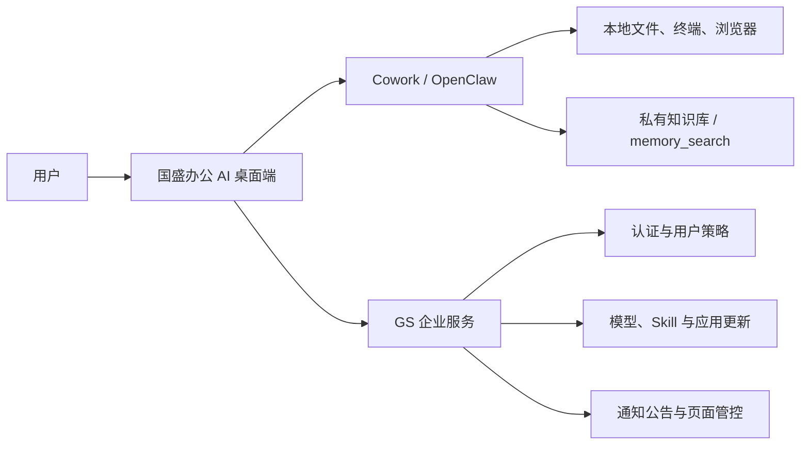

# 国盛证券AI办公协同 — LobsterAI 企业定制版

<p align="center">
  
</p>

<p align="center">
  <strong>面向国盛证券办公与投研场景的企业级桌面 Agent</strong>
</p>

<p align="center">
  <em><code>gsai-office-customization</code> 分支 · 当前版本 0.1.6</em>
</p>

<p align="center">
  
  
  
  <a href="LICENSE"></a>
</p>

<p align="center">
  <a href="#快速开始"><strong>快速开始</strong></a>
  &nbsp;·&nbsp;
  <a href="#企业定制配置"><strong>企业定制配置</strong></a>
  &nbsp;·&nbsp;
  <a href="README.md">English</a> · 中文
</p>

---

本分支基于开源项目 **LobsterAI**，针对国盛证券内网部署、统一身份、集中配置和投研办公流程进行了定制。应用保留 Cowork、OpenClaw、本地工具执行、Artifacts、持久记忆和定时任务等基础能力，同时增加企业登录、私有知识库、金融技能、模型与 Skill 云端管控、应用更新和通知公告。

默认品牌配置关闭网易有道云服务、IM 设置页、语音输入和图片/视频模型选择入口；会话、知识库和大部分工作数据保留在本机，企业服务端负责身份认证、策略与资源下发。

## 分支特性

- **企业白标** — 应用名称、图标、安装包文件名、默认工作区、关于页信息均由配置驱动
- **企业身份认证** — 支持账号密码、邮箱验证码和企业微信登录方式（以服务端下发为准），支持改密与离线配置兜底
- **集中管控** — 服务端可控制设置页、提交权限、外部 Skill 安装、Skill 启停、模型配置、应用更新与通知公告
- **私有知识库** — 支持创建多个本地知识库，批量导入文件或文件夹，并在对话中显式引用
- **金融投研技能** — 内置行情、异动归因、宏观资讯、主题概念、选股、个股/基金诊断及国盛通 AI 等技能
- **企业级 Skill 生命周期** — 自动同步服务端 Skill，按版本覆盖更新，并上报来源、风险级别、用户身份和 `SKILL.md` 内容指纹
- **办公报告增强** — `rich-report` 作为默认写作 Skill，支持 Word/Excel 输入、图表和统一报告样式
- **内网优先** — 可预置内部 OpenAI 兼容模型，并由服务端动态替换；默认阻断 LobsterAI 上游云接口

## 典型场景

| 场景 | 示例 |
|------|------|
| **私有资料问答** | 建立制度或投研资料知识库，导入 PDF、Word、Excel、CSV、Markdown 和文本文件，在对话中引用后检索回答 |
| **行情与异动分析** | 获取市场行情，结合异动归因、宏观资讯和主题概念形成分析结论 |
| **智能选股与诊断** | 使用智能选股、个股诊断、基金优选和基金诊断技能辅助研究 |
| **报告自动生成** | 将本地资料或 Excel 数据整理为带图表、统一版式的 Word 报告或 PPT |
| **企业统一配置** | 登录后自动应用服务端下发的模型、Skill、页面权限、提交策略和更新计划 |
| **持续办公自动化** | 使用本地文件、终端、浏览器和定时任务完成周期性整理、检查与交付 |

## 工作原理



## 快速开始

### 环境要求

- **Node.js** >= 24 < 25
- **npm** 或 **pnpm**
- Windows 打包需要 PowerShell、PortableGit，以及已安装的项目依赖

### 1. 克隆与安装

```bash
git clone https://github.com/baowanli719/LobsterAI.git
cd LobsterAI
git checkout gsai-office-customization
pnpm install
```

### 2. 启动应用

> [!IMPORTANT]
> Cowork 模式依赖 **OpenClaw** Agent 引擎。**首次启动必须先构建 OpenClaw runtime**，否则 Cowork 会话无法启动。首次启动请使用 `electron:dev:openclaw` 命令。

```bash
# 首次运行：先构建 OpenClaw runtime，再启动应用。
# 首次会自动克隆并构建 OpenClaw，可能需要几分钟。
npm run electron:dev:openclaw
```

runtime 构建完成后，日常开发可使用更快的命令 —— 它复用已构建的 runtime，跳过 OpenClaw 构建步骤：

```bash
npm run electron:dev
```

Vite 开发服务器默认运行在 `http://localhost:5175`。启动前请根据部署环境检查企业服务地址和默认模型配置；不要把真实 Token、口令或生产 API Key 提交到仓库。

### 企业定制配置

| 配置文件 / 入口 | 用途 |
|-----------------|------|
| `src/shared/branding/branding.config.json` | 应用名称、Logo、安装包名、功能开关、GS 服务端默认地址 |
| `src/shared/about/about.config.json` | 关于页产品名称、维护部门、联系人与链接 |
| `src/shared/defaultModel/defaultModel.config.json` | 首次启动时预置的 OpenAI 兼容模型；部署前替换地址和凭据 |
| `enterprise-config/manifest.json` | 机器级页面控制、服务地址锁定，以及 OpenClaw、Skills、Agents、MCP、Plugins 同步策略 |
| `SKILLs/skills.config.json` | 打包内置 Skill 的启停、排序和中文展示基础配置 |
| `GS_SERVER_URL` | 开发调试时覆盖企业服务地址的环境变量 |

企业服务地址按“用户本地覆盖 → `enterprise-config/manifest.json` → 品牌内置值 → `GS_SERVER_URL`”的优先级解析。若 manifest 设置 `server.lockBaseUrl=true`，用户不能在登录窗口修改服务器地址。

企业服务不可达时，客户端保留最近一次成功获取的用户与策略配置并进入离线状态；需要在线认证或服务端授权的操作仍会受到限制。

#### OpenClaw 构建选项

所依赖的 OpenClaw 版本在 `package.json` 的 `openclaw.version` 字段声明，源码默认克隆/管理在 `../openclaw`（相对于本仓库）。

```bash
# 指定 OpenClaw 源码路径
OPENCLAW_SRC=/path/to/openclaw npm run electron:dev:openclaw

# 强制重新构建（即使锁定版本未变）
OPENCLAW_FORCE_BUILD=1 npm run electron:dev:openclaw

# 跳过自动版本切换（如需本地开发 OpenClaw 时）
OPENCLAW_SKIP_ENSURE=1 npm run electron:dev:openclaw
```

### 生产构建

```bash
# 编译 TypeScript + Vite 打包
npm run build

# ESLint 代码检查
npm run lint
```

## 打包分发

<details>
<summary>构建命令、渠道包、手动构建 runtime 与 Windows Python 内置</summary>

使用 [electron-builder](https://www.electron.build/) 生成各平台安装包，输出到 `release/` 目录。

```bash
# macOS (.dmg)
npm run dist:mac

# macOS - 仅 Intel
npm run dist:mac:x64

# macOS - 仅 Apple Silicon
npm run dist:mac:arm64

# macOS - Universal (双架构)
npm run dist:mac:universal

# Windows (.exe NSIS 安装包)
npm run dist:win

# Linux (.AppImage)
npm run dist:linux

```

按照 keyfrom 打不同渠道的专属包
```
# macOS - 仅 Intel
KEYFROM=xxx npm run dist:mac:x64

# macOS - 仅 Apple Silicon
KEYFROM=xxx npm run dist:mac:arm64

# Windows (.exe NSIS 安装包)
npx cross-env KEYFROM=xxx npm run dist:win
```

桌面端打包（macOS / Windows / Linux）都会把预构建的 OpenClaw runtime 内置到 `Resources/cfmind`。
锁定的 OpenClaw 版本（`package.json` → `openclaw.version`）在打包时会自动拉取并构建，无需手动操作。
构建结果带缓存：如果本地已存在对应版本的 runtime，构建步骤会自动跳过。

也可以手动构建 OpenClaw runtime：

```bash
# 按当前主机平台自动选择 target（mac/win/linux + 架构）
npm run openclaw:runtime:host

# 显式指定目标平台
npm run openclaw:runtime:mac-arm64
npm run openclaw:runtime:mac-x64
npm run openclaw:runtime:win-x64
npm run openclaw:runtime:linux-x64
```

如需覆盖 OpenClaw 源码路径：

```bash
OPENCLAW_SRC=/path/to/openclaw npm run dist:win
```

Windows 打包会内置便携 Python 运行时到 `resources/python-win`（安装包资源目录为 `python-win`），终端用户无需手动安装 Python。
该运行时以解释器为主，不预装 LobsterAI 技能所需的 Python 三方包；相关依赖可在运行时按需安装。
默认情况下，如果未提供预构建压缩包，打包脚本会直接从 python.org 下载官方 embeddable Python 运行时。
离线或无法联网的构建场景，请显式提供预构建运行时压缩包。

企业离线/私有源打包可通过以下环境变量配置：
- `LOBSTERAI_PORTABLE_PYTHON_ARCHIVE`：本地预构建运行时压缩包路径（离线 CI/CD 推荐）
- `LOBSTERAI_PORTABLE_PYTHON_URL`：预构建运行时压缩包下载地址
- `LOBSTERAI_WINDOWS_EMBED_PYTHON_VERSION` / `LOBSTERAI_WINDOWS_EMBED_PYTHON_URL` / `LOBSTERAI_WINDOWS_GET_PIP_URL`：Windows 主机构建时自动拉取源的可选覆盖项

</details>

### Windows 快速打包

依赖未变化且 OpenClaw runtime 已准备好时，可直接调用快速脚本，避免 `pnpm run` 在构建中途触发隐式依赖重装或原生模块重编译：

```powershell
# 标准快速打包
.\scripts\dist-win-fast.ps1

# 首先重建 OpenClaw runtime
.\scripts\dist-win-fast.ps1 -PrepareOpenClawRuntime

# 增量构建：复用 renderer，并跳过 Skill 构建
.\scripts\dist-win-fast.ps1 -SkipRendererBuild -SkipSkills
```

脚本默认将 Node 堆上限提升到 4 GB，并直接调用本地工具链。依赖变化后应先手动执行 `pnpm install`。

## 架构概览

LobsterAI 采用 Electron 严格进程隔离架构，所有跨进程通信通过 IPC 完成。

### 进程模型

**Main Process**（`src/main/main.ts`）：
- 窗口生命周期管理
- SQLite 数据持久化
- OpenClaw Agent 引擎（主引擎）+ CoworkEngineRouter 调度层
- GS 企业认证、客户端策略刷新、通知公告、模型/Skill 自动同步与应用更新
- 私有知识库文件管理、格式转换与 OpenClaw `memory_search` 索引接线
- IM 网关代码仍保留，但当前品牌配置默认不启动、不展示设置入口
- 40+ IPC 通道处理
- 安全：context isolation 启用，node integration 禁用，sandbox 启用

**Preload Script**（`src/main/preload.ts`）：
- 通过 `contextBridge` 暴露 `window.electron` API
- 包含 `cowork` 命名空间用于会话管理和流式事件

**Renderer Process**（`src/renderer/`）：
- React 18 + Redux Toolkit + Tailwind CSS
- 企业登录、通知横幅、知识库、Skill 管理、Cowork 与设置界面
- 仅通过 IPC 与主进程通信

### 目录结构

<details>
<summary>查看完整源码目录</summary>

```
src/
├── main/                           # Electron 主进程
│   ├── main.ts                     # 入口，IPC 处理
│   ├── preload.ts                  # 安全桥接
│   ├── sqliteStore.ts              # SQLite 存储
│   ├── coworkStore.ts              # 会话/消息 CRUD
│   ├── skillManager.ts             # 技能管理
│   ├── im/                         # IM 网关（钉钉/飞书/Telegram/Discord）
│   └── libs/
│       ├── agentEngine/
│       │   ├── coworkEngineRouter.ts    # 调度层（将会话路由到当前激活的引擎）
│       │   ├── openclawRuntimeAdapter.ts # 主引擎 OpenClaw 网关适配器
│       │   └── claudeRuntimeAdapter.ts  # 旧内置适配器（已废弃）
│       ├── coworkRunner.ts          # 旧内置执行器（已废弃）
│       ├── openclawEngineManager.ts # OpenClaw 运行时生命周期管理
│       ├── openclawConfigSync.ts    # 同步 cowork、模型和知识库索引配置
│       ├── gsServerAuth.ts          # 企业登录、策略刷新与公告配置
│       ├── gsModelSync.ts           # 服务端模型配置应用
│       ├── gsSkillSync.ts           # 服务端 Skill 同步与安装清单上报
│       ├── knowledgeBaseManager.ts  # 私有知识库文件管理
│       └── knowledgeBaseImportConverters.ts # Office/PDF 文本转换
│
├── renderer/                        # React 前端
│   ├── App.tsx                     # 根组件
│   ├── types/                      # TypeScript 类型定义
│   ├── store/slices/               # Redux 状态切片
│   ├── services/                   # 业务逻辑层（API/IPC/i18n）
│   └── components/
│       ├── cowork/                 # Cowork UI 组件
│       ├── artifacts/              # Artifact 渲染器
│       ├── skills/                 # 受企业策略约束的技能管理 UI
│       ├── kits/                   # 专家套件与知识库 UI
│       ├── im/                     # IM 集成 UI
│       ├── GsLoginDialog.tsx       # 企业登录
│       ├── GsNoticeBanner.tsx      # 服务端通知公告
│       └── Settings.tsx            # 设置面板与页面管控
│
SKILLs/                              # 技能定义目录
├── skills.config.json              # 技能启停与排序配置
├── web-search/                     # Web 搜索
├── docx/                           # Word 文档生成
├── xlsx/                           # Excel 表格
├── pptx/                           # PowerPoint 演示
├── pdf/                            # PDF 处理
├── rich-report/                    # 企业报告生成
├── market_quotes/                  # 市场行情
├── stock_diagnosis/                # 个股诊断
├── fund_diagnosis/                 # 基金诊断
├── playwright/                     # Web 自动化
└── ...                             # 更多技能
```

</details>

## Cowork 系统

Cowork 是 LobsterAI 的核心功能 —— 以 OpenClaw 为主引擎的 AI 工作会话系统。它面向办公场景设计，能够自主完成数据分析、文档生成、信息检索等复杂任务。

<details>
<summary>执行模式、流式事件与权限控制</summary>

### 执行模式

| 模式 | 说明 |
|------|------|
| `auto` | 自动根据上下文选择执行方式 |
| `local` | 本地直接执行，全速运行 |

### 流式事件

Cowork 通过 IPC 事件实现实时双向通信：

- `message` — 新消息加入会话
- `messageUpdate` — 流式内容增量更新
- `permissionRequest` — 工具执行需要用户审批
- `complete` — 会话执行完毕
- `error` — 执行出错

### 权限控制

所有涉及文件系统、终端命令、网络请求的工具调用都需要用户在 `CoworkPermissionModal` 中明确批准。支持单次批准和会话级批准。

</details>


## 技能系统

本分支以办公与金融投研 Skill 为核心，通过 `SKILLs/skills.config.json` 配置内置 Skill 的启停和排序。服务端上传的 Skill 会在登录或策略刷新后按版本自动同步到本地。

<details>
<summary>查看主要技能</summary>

| 技能 | 功能 | 典型场景 |
|------|------|---------|
| rich-report | 企业报告生成 | Word/Excel 输入、图表、统一样式报告 |
| web-search | Web 搜索 | 信息检索、资料收集 |
| docx | Word 文档生成 | 报告撰写、方案输出 |
| xlsx | Excel 表格生成 | 数据分析、报表制作 |
| pptx | PowerPoint 制作 | 演示文稿、汇报材料 |
| pdf | PDF 处理 | 文档解析、格式转换 |
| playwright | Web 自动化 | 网页操作、自动化测试 |
| market_quotes | 市场行情 | 指数、股票、基金行情查询 |
| movement_attribution | 异动归因 | 分析市场或标的异动原因 |
| macro_news | 宏观资讯 | 宏观政策与市场新闻整理 |
| theme_concept | 主题概念 | 主题与概念线索研究 |
| smart_stock_screener | 智能选股 | 根据条件筛选股票 |
| stock_diagnosis | 个股诊断 | 个股基本面与交易表现分析 |
| smart_fund_picker | 基金优选 | 根据目标筛选基金 |
| fund_diagnosis | 基金诊断 | 基金表现与风险分析 |
| gst_ai_chat | 国盛通 AI | 对接国盛业务问答能力 |
| stock-analyzer | 股票深度分析 | A 股深度研究、估值与财报分析 |
| stock-announcements | 股票公告获取 | 上市公司公告检索、信息披露查阅 |
| stock-explorer | 股票信息探索 | 股票基本信息查询、行情概览 |
| local-tools | 本地系统工具 | 文件管理、系统操作 |
| imap-smtp-email | 邮件收发 | 邮件处理、自动回复 |
| create-plan | 计划编排 | 项目规划、任务分解 |
| skill-vetter | 技能安全审查 | 安装第三方技能前的安全检验 |
| skill-creator | 自定义技能创建 | 扩展新能力 |

</details>

影视搜索、音乐搜索和有道云笔记已从默认安装包移除。图片/视频生成相关 Skill 仍可按部署需要保留，但当前品牌配置隐藏对应模型选择入口。

企业策略 `permissions.allowExternalSkillInstall=false` 时，市场、ZIP、文件夹和远程地址等外部安装入口全部隐藏，同时主进程会拦截来路不明的本地 Skill。服务端还可对指定 Skill 强制开启或关闭。

## 定时任务

LobsterAI 支持创建定时任务，让 Agent 按计划自动执行重复性工作。

### 创建方式

- **对话式创建** — 直接用自然语言告诉 Agent（如「每天早上 9 点帮我收集科技新闻」），Agent 会自动创建对应的定时任务
- **GUI 界面创建** — 在定时任务管理面板中手动添加，可视化配置执行时间和任务内容

### 典型场景

| 场景 | 示例 |
|------|------|
| 新闻收集 | 每天早上自动收集行业资讯并生成摘要 |
| 邮箱整理 | 定时检查收件箱，分类整理并汇总重要邮件 |
| 数据报告 | 每周自动生成业务数据分析报告 |
| 信息监控 | 定期检查指定网站内容变化并通知 |
| 工作提醒 | 按计划生成待办事项清单或会议纪要 |

定时任务基于 Cron 表达式调度，支持分钟、小时、日、周、月等多种周期粒度。任务执行时会自动启动 Cowork 会话，结果默认在桌面端查看；启用 IM 网关后也可扩展移动端通知。

## IM 集成

上游 LobsterAI 的微信、企微、钉钉、飞书、QQ、Telegram、Discord、云信和 POPO 网关代码仍保留，但本分支的默认品牌配置设置 `showImChannels=false`：主进程不启动 IM 网关，设置页也不展示 IM 入口。

如部署环境需要 IM 机器人，可在 `src/shared/branding/branding.config.json` 中显式开启，并通过 `enterprise-config` 或设置页提供平台凭据。该功能不属于当前默认交付范围。

## 私有知识库

- 在专家套件页面创建、重命名和删除多个知识库
- 支持选择文件或递归导入文件夹；格式包括 `.md`、`.txt`、`.csv`、`.docx`、`.xlsx`、`.xls` 和 `.pdf`
- 富格式文件在导入时转换为 Markdown 文本，原始资料不上传到上游云服务
- 单个源文件或转换结果上限为 5 MB，单批文件夹导入最多展开 500 个文件
- 启用 Embedding 后，知识库目录通过 `memorySearch.extraPaths` 纳入 OpenClaw 全局索引
- 在输入框引用知识库时，Agent 会优先检索该目录；检索不可用时可降级为直接读取 Markdown 文件

知识库文件保存在 OpenClaw 状态目录的 `knowledge-bases/<kbId>/` 下，每个知识库包含 `kb.json` 元数据和转换后的 `.md` 文档。

## 持久记忆

LobsterAI 的记忆系统基于 OpenClaw，以文件形式持久化存储在工作目录中，让 Agent 跨会话记住你的信息和偏好。

### 记忆文件结构

| 文件 | 用途 |
|------|------|
| `MEMORY.md` | 持久化事实、偏好与决策，每次会话启动时自动加载 |
| `memory/YYYY-MM-DD.md` | 每日临时笔记，保留近期上下文 |
| `USER.md` | 用户档案（姓名、职业、习惯等长期信息） |
| `SOUL.md` | Agent 个性与行为准则 |

### 记忆的写入方式

- **显式指令** — 对话中说「记住 xxx」「以后回复用英文」等，Agent 会在回复前先调用 `write` 工具将信息写入 `MEMORY.md`，确认写入成功后再回复「记住了」
- **Agent 自动记录** — Agent 在执行任务过程中可主动将重要发现、配置、环境信息等写入记忆文件，无需用户显式要求
- **GUI 手动管理** — 在设置面板的记忆管理界面中直接添加、编辑、删除 `MEMORY.md` 中的条目；支持关键词搜索

### 工作机制

每次会话启动时，OpenClaw 会按顺序读取 `SOUL.md`、`USER.md`、今日及昨日的 `memory/YYYY-MM-DD.md`，以及 `MEMORY.md`，将这些内容作为上下文注入，使 Agent 无需用户重复说明就能延续上次的偏好和认知。

记忆写入通过文件工具完成，不依赖任何后台提取或推断，内容完全由用户或 Agent 明确控制。

## 数据存储

会话、配置、企业登录缓存和策略快照存储在本地 SQLite 数据库（`lobsterai.sqlite`，位于用户数据目录）；知识库和 OpenClaw 记忆以文件形式存储在 OpenClaw 状态目录。

<details>
<summary>数据库表</summary>

| 表 | 用途 |
|----|------|
| `kv` | 应用配置键值对 |
| `cowork_config` | Cowork 设置（工作目录、系统提示词、执行模式） |
| `cowork_sessions` | 会话元数据 |
| `cowork_messages` | 消息历史 |
| `user_memories` | 用户记忆条目 |
| `user_memory_sources` | 记忆来源追踪 |
| `agents` | 自定义 Agent 配置 |
| `mcp_servers` | MCP 服务器配置 |
| `im_config` | IM 网关配置（各平台 Token/密钥） |
| `im_session_mappings` | IM 会话与 Cowork 会话的映射关系 |
| `scheduled_task_meta` | 定时任务元数据（来源与绑定信息） |

</details>

企业登录 Token、最近一次用户信息、客户端策略、服务器地址覆盖和云端模型清单通过 `kv` 表持久化。知识库不写入 SQLite，以独立目录形式参与本地索引。

## 安全模型

本分支在 LobsterAI 基础安全模型上增加企业策略控制：

- **进程隔离** — context isolation 启用，node integration 禁用
- **权限门控** — 敏感工具调用需用户明确审批
- **工作区边界** — 文件操作限制在指定工作目录内
- **IPC 验证** — 所有跨进程调用经过类型检查
- **上游云服务熔断** — `disableCloudServices=true` 时统一阻断网易有道 API 端点
- **Skill 白名单** — 服务端禁止外部安装时，隐藏安装入口并阻止加载未托管 Skill
- **配置收敛** — 服务端可将设置页设为隐藏、只读或可编辑，并可禁止提交任务
- **内容完整性** — 已安装 Skill 上报 `SKILL.md` 的 SHA-256 指纹，便于服务端识别内容变化

## 技术栈

<details>
<summary>完整技术栈</summary>

| 层 | 技术 |
|----|------|
| 框架 | Electron 40 |
| 前端 | React 18 + TypeScript |
| 构建 | Vite 5 |
| 样式 | Tailwind CSS 3 |
| 状态 | Redux Toolkit |
| AI 引擎 | OpenClaw（主引擎） |
| 存储 | better-sqlite3 |
| 企业服务 | GS REST API（认证、配置、Skill、模型、更新、公告） |
| 知识库 | 本地 Markdown + OpenClaw memory_search |
| Markdown | react-markdown + remark-gfm + rehype-katex |
| 图表 | Mermaid |
| 安全 | DOMPurify |
| IM | @larksuiteoapi/node-sdk · nim-web-sdk-ng · @wecom/wecom-aibot-sdk · OpenClaw 网关（钉钉 / Telegram / Discord / QQ 等） |

</details>

## 配置

### 应用配置

应用级配置存储在 SQLite `kv` 表中，通过设置面板修改；品牌和部署默认值由“企业定制配置”一节列出的 JSON 文件控制。

登录后，企业服务可动态下发：

- 设置页 `hidden` / `readonly` / `editable` 状态
- 是否允许提交任务、安装外部 Skill 和使用自定义模型
- 指定 Skill 的强制启用/停用状态
- OpenAI 兼容模型 Provider、模型列表与默认模型
- 客户端版本、下载地址、可下载时间和每日自动下载窗口
- 带起止时间和可关闭策略的底部通知公告

云端模型更新会写入 `app_config` 并同步 OpenClaw；服务端移除的托管 Provider 会被清理，但不会删除用户自行创建且未被云端托管的 Provider。

### Cowork 配置

Cowork 会话配置包含：

- **工作目录** — Agent 操作的根目录
- **系统提示词** — 自定义 Agent 行为

### 国际化

界面仍支持中文和英文。为保证企业办公输出一致，本分支通过托管 `AGENTS.md` 策略要求 Agent 执行过程使用简体中文。

## OpenClaw 版本管理

<details>
<summary>版本锁定、工作原理、更新方式与环境变量</summary>

LobsterAI 将 OpenClaw 依赖锁定到指定的 release 版本，在 `package.json` 中声明：

```json
{
  "openclaw": {
    "version": "v2026.4.14",
    "repo": "https://github.com/openclaw/openclaw.git"
  }
}
```

### 工作原理

| 步骤 | 行为 | 时机 |
|------|------|------|
| **版本确认** | 克隆或切换 `../openclaw` 到锁定的 tag | 每次 runtime 构建前 |
| **构建缓存检查** | 比对锁定版本与 `runtime-build-info.json` | 每次 runtime 构建前 |
| **完整构建** | `pnpm install` → `build` → `ui:build` → 打包为 asar | 仅版本变更时 |

### 更新 OpenClaw 版本

1. 修改 `package.json` 中 `openclaw.version` 为目标 release tag
2. 执行 `npm run electron:dev:openclaw` 或 `npm run dist:win` — 新版本会自动拉取并构建
3. 提交 `package.json` 的变更

### 环境变量

| 变量 | 说明 | 默认值 |
|------|------|--------|
| `OPENCLAW_SRC` | OpenClaw 源码目录路径 | `../openclaw` |
| `OPENCLAW_FORCE_BUILD` | 设为 `1` 强制重新构建（即使版本匹配） | — |
| `OPENCLAW_SKIP_ENSURE` | 设为 `1` 跳过自动版本切换 | — |

</details>

## 测试

<details>
<summary>运行测试与编写测试文件</summary>

单元测试使用 [Vitest](https://vitest.dev/)，测试文件与被测源文件**同目录存放**。

```bash
# 运行全部测试
npm test

# 只运行指定模块的测试（按文件名过滤）
npm test -- logger
npm test -- cowork
```

新增测试文件放在对应源文件旁边，使用 `.test.ts` 扩展名：

```
src/main/
├── foo.ts
└── foo.test.ts
```

示例（`src/main/logger.test.ts`）：

```ts
import { test, expect } from 'vitest';

test('log file pattern matches daily name', () => {
  expect(/^main-\d{4}-\d{2}-\d{2}\.log$/.test('main-2026-03-20.log')).toBe(true);
});
```

避免在测试中引入 Electron 专属 API（如 `electron-log`），改为将相关逻辑内联到测试文件中。

</details>

## 开发规范

- TypeScript 严格模式，函数式组件 + Hooks
- 2 空格缩进，单引号，分号
- 组件 `PascalCase`，函数/变量 `camelCase`，Redux 切片 `*Slice.ts`
- Tailwind CSS 优先，避免自定义 CSS
- 提交信息遵循 `type: short imperative summary` 格式（如 `feat: add artifact toolbar`）

## 维护与支持

- 维护部门：信息技术部
- 联系人：包万里
- 联系邮箱：`baowanli@gszq.com`

客户端“关于”页面的信息由 `src/shared/about/about.config.json` 管理，部署时可按维护责任更新。

## 贡献

1. Fork 本仓库
2. 创建特性分支 (`git checkout -b feature/your-feature`)
3. 提交改动 (`git commit -m 'feat: add something'`)
4. 推送到远程 (`git push origin feature/your-feature`)
5. 发起 Pull Request

PR 描述中请包含：变更说明、关联 issue、UI 变更附截图，以及涉及 Electron 特定行为的说明。

## 许可证

[MIT License](LICENSE)


---

本项目基于网易有道开源的 [LobsterAI](https://github.com/netease-youdao/LobsterAI) 定制，企业版由国盛证券信息技术部维护。
